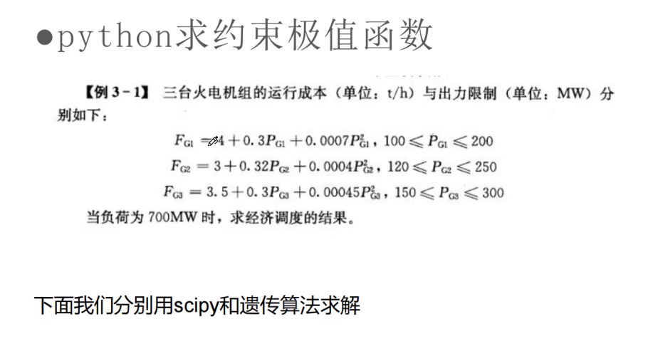

# 一、线性规划模型

线性规划：求线性目标函数在目标函数可行域内的**最值问题**。

本质：问题是线性的，约束是线性的。

例题一：线性规划求解

>  见`linear_regulation.py`

求极大值目标函数要取负，大于或等于的不等式也要取负。

 

为什么要引入松弛变量？

# 二、非线性规划模型

二次规划的基本形式

多元函数：**一个坐标集**到**一个数集**的映射。

多元函数的微分：**全微分**和**偏微分**。

多元函数的极值：每个能让**偏微分为0**的点是极值点。

拉格朗日乘子法与`KKT`条件

引入拉格朗日乘子

引入`KKT`条件

求解二次规划

例题

# 三、非线性规划的两个案例

# 四、 整数规划模型

# 五、动态规划模型

- 动态规划(Dynamic Programming)算法的核心思想是：**将大问题划分为小问题进行解决**，从而一步步获取最优解的处理算法
- 动态规划算法与分治算法类似，其基本思想也是将待求解问题分解成若干个子问题，先求解子问题，然后从这些子问题的解得到原问题的解
- 与分治法不同的是，适合于用动态规划求解的问题，经分解得到子问题往往不是互相独立的。( 即下一个子阶段的求解是**建立在上一个子阶段的解的基础上**，进行进一步的求解)
- 动态规划可以**通过填表的方式**来逐步推进，得到最优解

**状态空间树与剪枝**

# 六、贪心算法

贪心算法总是作出在**当前看来是最好的选择**。也就是说贪心算法并不从整体最优上加以考虑，它所作出的选择只是在某种意义上的**局部最优选择**。当然，我们希望贪心算法得到的最终结果也是整体最优的。

贪心和dp的联系是非常紧密的，我们先来分析一下贪心和dp的不同之处：dp是根据迁移过程的状态去推导下一个过程的状态，是有理论依据的，是讲道理的，通过每次完美的检验而得到最优解，关键是找最优子结构和重复子问题，书上一句原话：dp的子结构必须的独立的，而且是重叠的。

# 七、如何建立好的模型

