# 一、高等数学知识回顾与微分方程的形式定义

## 01 微分方程的理论基础

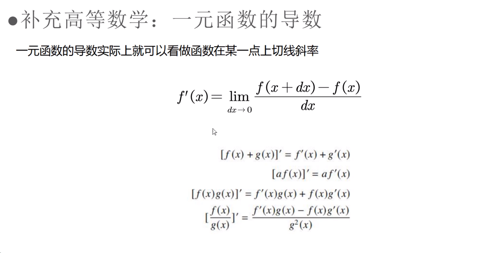

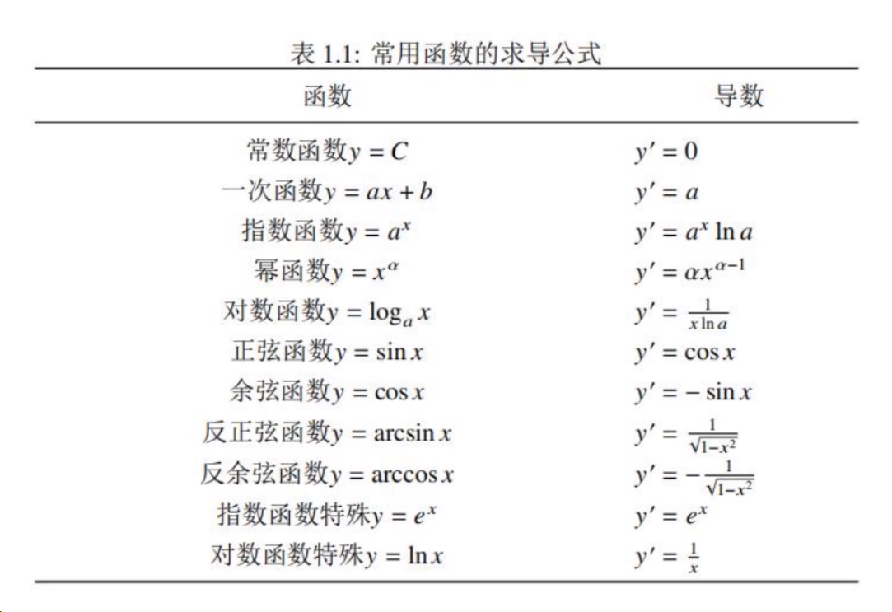

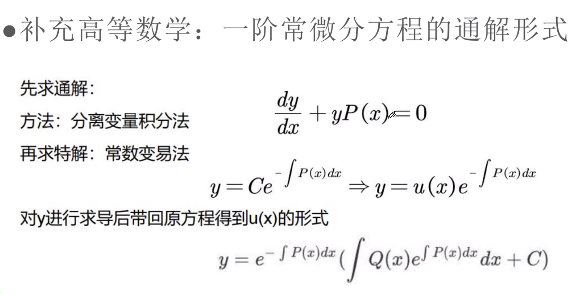

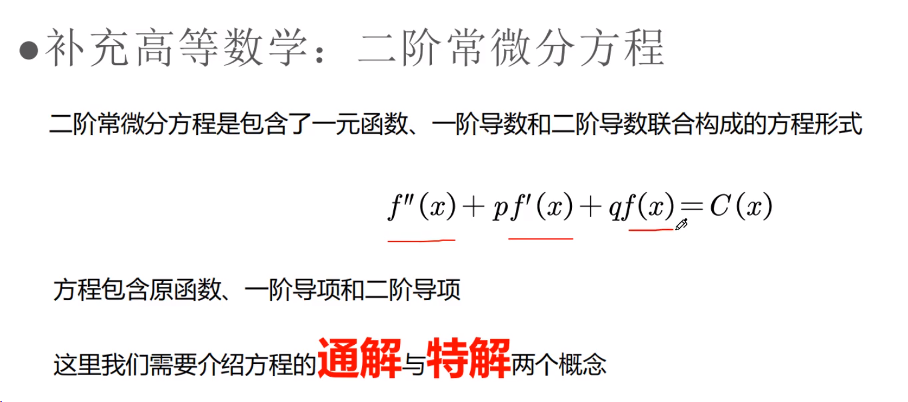

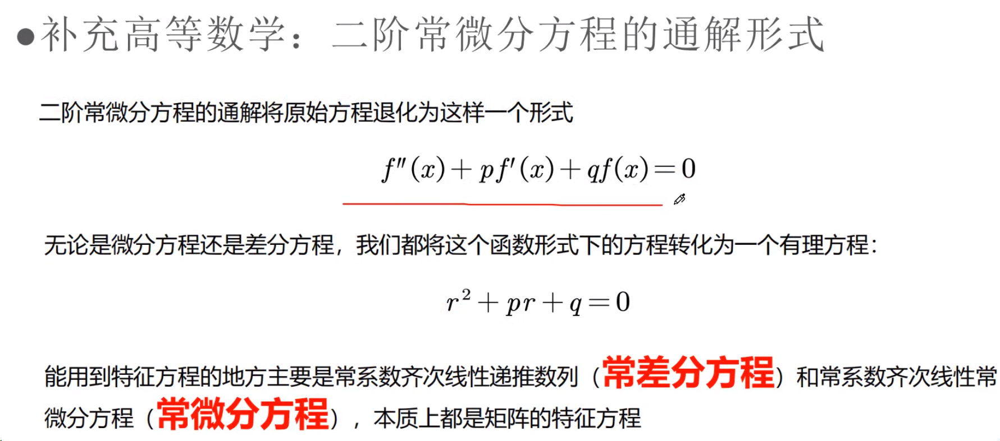

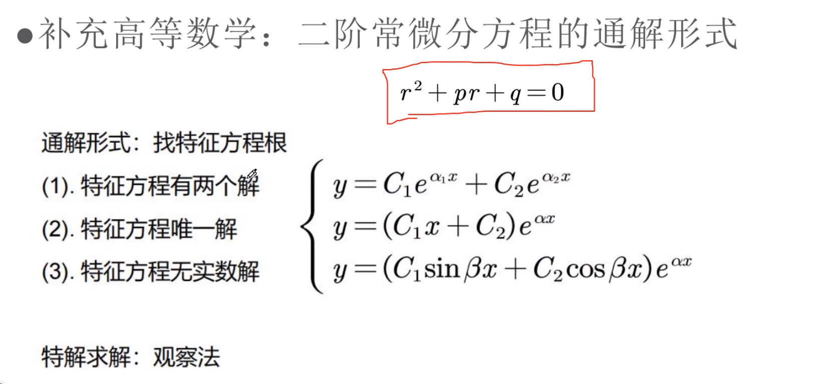

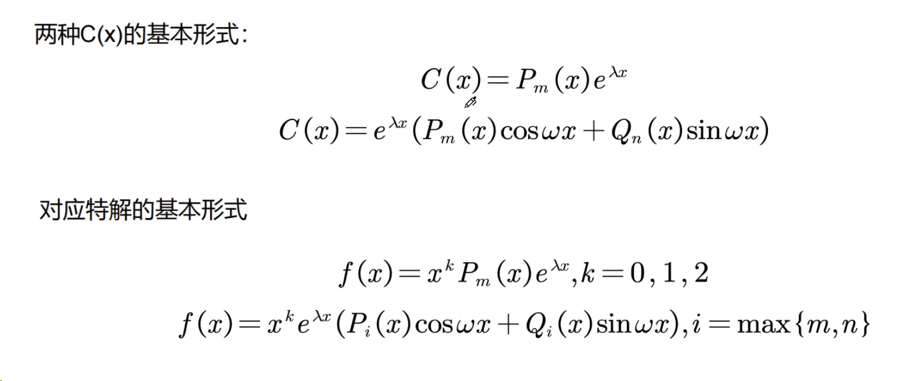

## 02 常微分方程的求解

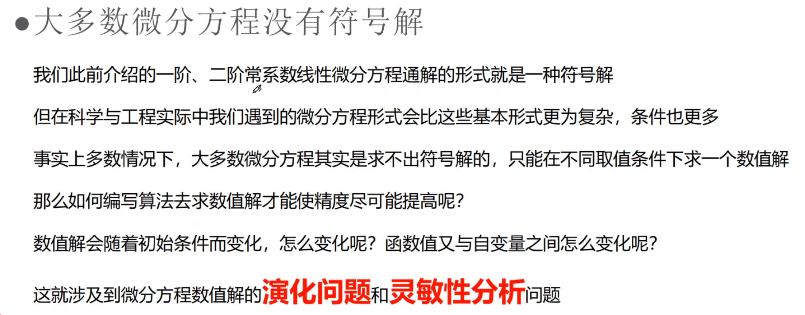

> ordinary_differential_equation_exp1.py

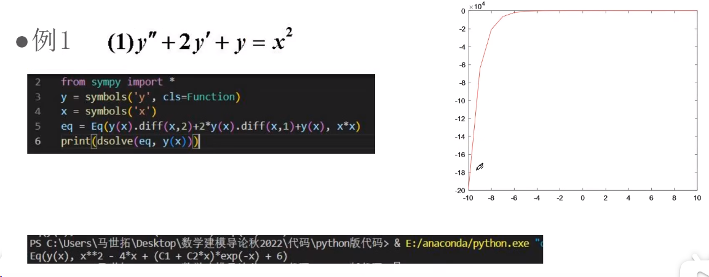

> ordinary_differential_equation_exp2.py

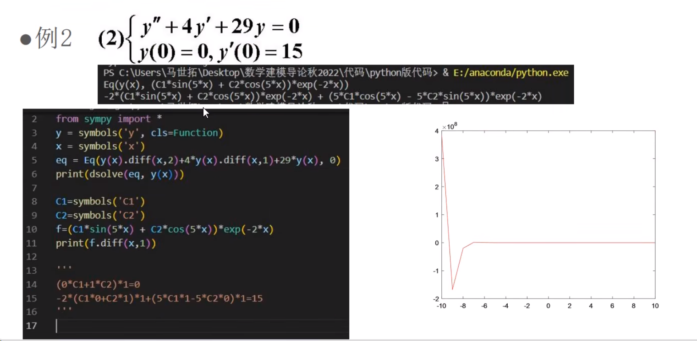

## 03 python求微分方程数值解

> ordinary_differential_equation_exp3.py

> ordinary_differential_equation_exp4.py

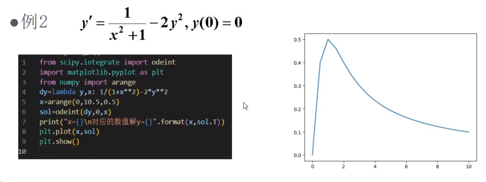

> ordinary_differential_equation_exp5.py

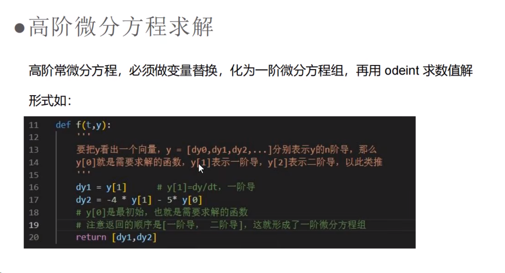

## 04 偏微分方程

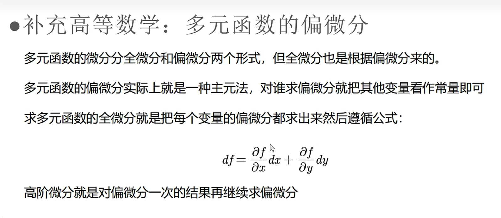

**差分代替微分**

> PDE_exp1.py

> PDE_exp2.py

